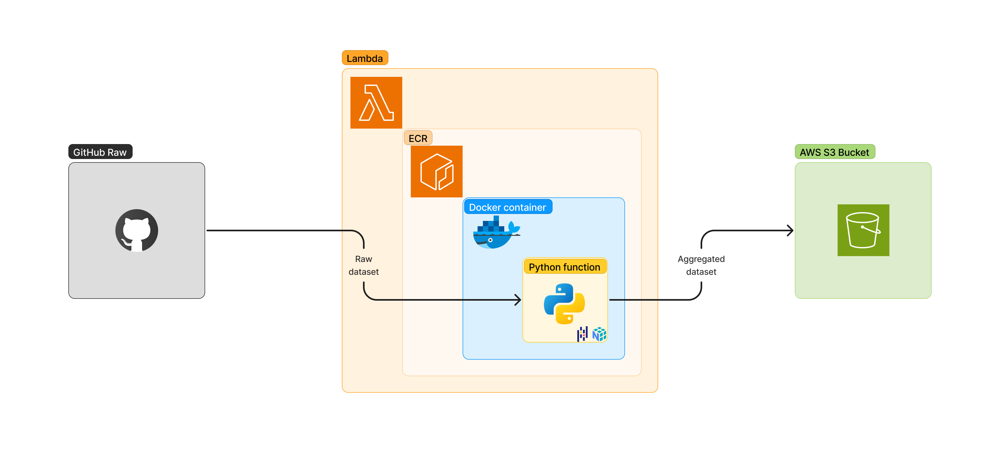

# 1. Introduction
This project shows an example of a working ETL task running on AWS with containerization approach. At a high level, this app extracts raw information, transforms it by performing aggregations and stores it using the optimized file format from Apache, parquet.

- [1. Introduction](#1-introduction)
- [2. Prerequisites](#2-prerequisites)
- [3. Architecture](#3-architecture)
  - [3.1. Raw data](#31-raw-data)
  - [3.2. Python function](#32-python-function)
  - [3.3. Docker image](#33-docker-image)
  - [3.4. ECR](#34-ecr)
  - [3.5. The Lambda function](#35-the-lambda-function)
    - [3.5.1. IAM Role](#351-iam-role)
  - [3.6. S3 bucket](#36-s3-bucket)
- [4. Conclusions](#4-conclusions)
- [5. Further work](#5-further-work)

# 2. Prerequisites
The following were used in this project:
- [Python 3.10](https://www.python.org/downloads/release/python-3100/)
- An active account on [AWS](https://aws.amazon.com/) as well as some experience in:
  - AWS [S3](https://docs.aws.amazon.com/AmazonS3/latest/userguide/Welcome.html)
  - AWS [Lambda](https://docs.aws.amazon.com/lambda/latest/dg/welcome.html)
  - AWS [ECR](https://docs.aws.amazon.com/AmazonECR/latest/userguide/what-is-ecr.html)
- A bit of experience with [Docker](https://www.docker.com/) containers
- Basic understanding on [Pandas](https://pandas.pydata.org/), [NumPy](https://numpy.org/) and Python [environments](https://docs.python.org/3/tutorial/venv.html)

# 3. Architecture
The Extract Transform and Load approach is shown in the following diagram (gray, orange and green sections respectively):



The data is conformed by a randomly generated dataset hosted on [GitHub](https://github.com/BetoAvila/datasets/blob/main/random_datasets/ds_1.csv), which is pulled from a python script containerized with Docker, hosted on AWS ECR as a container image to be later used in the AWS Lambda function. This python script aggregates and transforms the data in a simple straight forward fashion to be later stored in a S3 bucket as a parquet file. Despite the Lambda function does not have any trigger attached to it this shows an example of its usage.

## 3.1. Raw data
As mentioned above, the raw information was randomly created and [hosted on GitHub](https://github.com/BetoAvila/datasets/blob/main/random_datasets/ds_1.csv) for its simplicity and ease of access. It resembles a remote DB, SFTP server or any other data storage solution to use in this example. A sample of this data is shown below:

| id [str] | class [str] | memory [int16] | percentage [float16] | ratio [float16] | fob [str] | dp [str] | recovered [int8] |
| -------- | ----------- | -------------- | -------------------- | --------------- | --------- | -------- | ---------------- |
| 1        | c1          | 192            | 0.728948119          | 7.617868963     | fob_4     | dp_3     | 0                |
| 2        | c2          | 162            | 0.06520009           | 2.308398726     | fob_2     | dp_3     | 0                |
| 3        | c3          | 147            | 0.537022958          | 2.293197688     | fob_3     | dp_2     | 0                |
| 4        | x3          | 442            | 0.899959715          | 4.963764038     | fob_2     | dp_5     | 0                |

## 3.2. Python function
The actual logic of this app lies on the [python script](./python_function/lambda_function.py) which is nothing particularly complex but has some important details. The function and file must have specific names as it is required by the Lambda function, hence, `lambda_function.py` and `lambda_handler` are used.

## 3.3. Docker image
Once the functionality is working we need to create a Docker image to push it to ECR so the Lambda can use it. Given that Lambda functions are very limited in terms of storage to a few hundred MB, this implementation offers the easiest solution.

The [`Dockerfile`](./python_function/Dockerfile) defines the instructions to build the image, please consider the command `CMD` is set as `CMD [ "lambda_function.lambda_handler" ]` instead of other commonly used commands. Refer to [ECR reference](https://docs.aws.amazon.com/AmazonECR/latest/userguide/what-is-ecr.html) for further details.

The environment used to execute these instructions is defined in the [`reqs.txt`](./python_function/reqs.txt), this is python 3.10 and the following libraries:

```
pandas==2.1
numpy==1.24.3
aiobotocore==2.5.0
boto3==1.26.76
botocore==1.29.76
s3fs==2023.5.0
pyarrow==12.0.0
```

When the Dockerfile is complete We proceed to push the image to ECR so its visible to the Lambda function.

## 3.4. ECR
ECR stands for Elastic Container Registry and it's the solution provided by AWS to host and manage Docker images. To push the image into the registry execute the following:

```
# Build image named 'create-parquet-files' from Dockerfile
docker buildx build --platform linux/arm64 -t create-parquet-files:latest .

# Upload the image to the Amazon ECR repository
# Login (replace 112233445566 with your AWS client number)
aws ecr get-login-password --region us-east-1 | docker login --username AWS --password-stdin 112233445566.dkr.ecr.us-east-1.amazonaws.com

## Create repo (if not created already) in this case named 'lambda-images-repo'
aws ecr create-repository --repository-name lambda-images-repo --image-scanning-configuration scanOnPush=true --image-tag-mutability MUTABLE

## Tag image
docker tag create-parquet-files:latest 112233445566.dkr.ecr.us-east-1.amazonaws.com/lambda-images-repo:latest

## Push image
docker push 112233445566.dkr.ecr.us-east-1.amazonaws.com/lambda-images-repo:latest
```
This should enable the usage of this image in lambda functions.

## 3.5. The Lambda function
Completed the above, the Lambda function can use the image on ECR created in the previous step. But an extra step must be completed before running the function.

### 3.5.1. IAM Role
The Lambda function requires an IAM role to be able to execute the code on behalf of the coder and in their absence. Thus a role on IAM should be set prior to creating the Lambda function. Under the IAM section on Roles on the left bar a new role can be defined with the permissions needed to run the script. Below is an example of the required permissions:
```
{
    "Version": "2012-10-17",
    "Statement": [
        {
            "Sid": "VisualEditor0",
            "Effect": "Allow",
            "Action": [
                "athena:TerminateSession",
                "athena:CreateDataCatalog",
                "athena:GetTableMetadata",
                "athena:StartQueryExecution",
                "athena:GetSession",
                "athena:GetCalculationExecution",
                "athena:GetQueryResults",
                "athena:ListCalculationExecutions",
                "athena:GetDatabase",
                "athena:GetNamedQuery",
                "athena:CreateWorkGroup",
                "athena:ListQueryExecutions",
                "athena:ListNamedQueries",
                "athena:ListSessions",
                "athena:CreateNamedQuery",
                "athena:ListDatabases",
                "athena:GetSessionStatus",
                "athena:StopQueryExecution",
                "athena:GetQueryExecution",
                "athena:StartSession",
                "athena:ListTableMetadata",
                "athena:CreateNotebook"
            ],
            "Resource": [
                "arn:aws:athena:*:112233445566:workgroup/*",
                "arn:aws:athena:*:112233445566:datacatalog/*"
            ]
        },
        {
            "Sid": "VisualEditor1",
            "Effect": "Allow",
            "Action": [
                "athena:ListDataCatalogs",
                "lambda:CreateCodeSigningConfig",
                "lambda:CreateEventSourceMapping",
                "lambda:CreateFunction",
                "lambda:GetAccountSettings",
                "lambda:GetAlias",
                "lambda:GetCodeSigningConfig",
                "lambda:GetEventSourceMapping",
                "lambda:GetFunction",
                "lambda:GetFunctionCodeSigningConfig",
                "lambda:GetFunctionConfiguration",
                "lambda:GetFunctionEventInvokeConfig",
                "lambda:GetLayerVersionPolicy",
                "lambda:GetPolicy",
                "lambda:InvokeFunction",
                "lambda:PutRuntimeManagementConfig",
                "lambda:TagResource",
                "lambda:UntagResource",
                "lambda:UpdateFunctionCode",
                "s3:CreateAccessPoint",
                "s3:CreateAccessPointForObjectLambda",
                "s3:CreateBucket",
                "s3:CreateJob",
                "s3:DescribeJob",
                "s3:GetBucketLocation",
                "s3:GetLifecycleConfiguration",
                "s3:GetObject",
                "s3:ListAccessPoints",
                "s3:ListAccessPointsForObjectLambda",
                "s3:ListAllMyBuckets",
                "s3:ListBucket",
                "s3:ListJobs",
                "s3:PutObject"
            ],
            "Resource": "*"
        }
    ]
}
```

Upon finishing the above, the Lambda function can be created and executed.

## 3.6. S3 bucket
When the function is successfully executed, we can expect the resulting parquet file to be placed at the location specified by the python script, thus completing the functionality of this app.

# 4. Conclusions
- Flexible. It can be used in microservices, mobile, web, data engineering, image processing and many other instances given that anything can be coded and containerized using python (or any other supported language) and Docker.
- Powerful. This solution can be adapted to work with many different workloads and complexity (storage and RAM) as containers are quite customizable. Although it has its limits in terms of computing power and storage capacity, this will suffice many use cases.
- Cheap and coherent. Given that all these tools reside in the same AWS environment, interactions and coherence are inherent in them and the cost associated is also very competitive.

# 5. Further work
Given that these are beyond the scope of this example, here are some recommendations and further options:

- [Triggers](https://docs.aws.amazon.com/lambda/latest/dg/gettingstarted-concepts.html#gettingstarted-concepts-trigger) for Lambda functions. These can be set up to execute the function when one of certain events occur, like a commit in a code repo, a change in a DB, an update in a S3 bucket and many others.
- [Runtime](https://docs.aws.amazon.com/lambda/latest/dg/lambda-runtimes.html) configuration. As the Lambda function has important limitations on storage, it can be adjusted to work with specific RAM memory and timeout options. So we can define how much memory we are dedicating to the function and how much we can consider as timeout if the function does not end its execution.
- [Layers](https://docs.aws.amazon.com/lambda/latest/dg/chapter-layers.html). If the solution with containers and ECR is not suitable, this is another option, but with the disadvantage of storage memory.